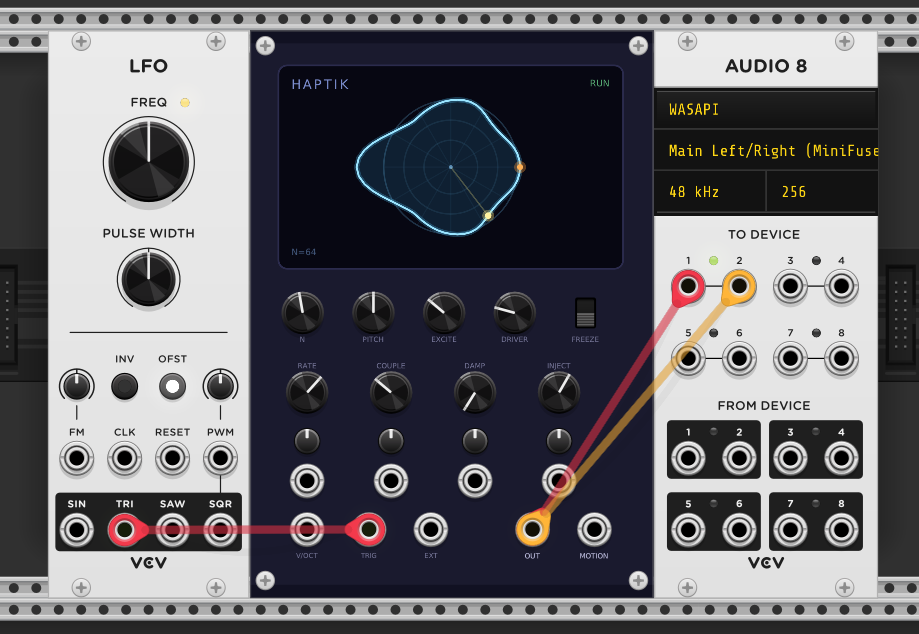

# Haptik

A scanned-synthesis oscillator for VCV Rack 2.



Haptik builds its waveform from a little physical system: a ring of masses joined
by springs. You set the ring moving (a pluck, a bump, noise, or an external
signal), and a phase pointer sweeps around the ring at audio rate, reading off
the displacement of each mass in turn. That sequence of displacements *is* the
output waveform. Because the sweep rate (pitch) is independent of the spring
physics, the same moving shape can be played at any pitch — or frozen and played
as a static wavetable.

## How it works

Scanned synthesis, invented by Max Mathews, Bill Verplank and Rob Shaw, separates
two things a normal oscillator fuses together:

- **A dynamical system** — here, a closed ring of `N` masses. Each mass is pulled
  toward its neighbours (the **COUPLE** stiffness) and toward its rest position
  (the **RATE**/centering force), and loses energy over time (**DAMP**). This is
  integrated once per sample with a symplectic (semi-implicit) Euler step, which
  is cheap and — with the coupling capped — unconditionally stable.
- **A scanning function** — a phase pointer that runs around the ring at the pitch
  frequency, linearly interpolating between adjacent masses to read out a sample.

The payoff is that **timbre and pitch are decoupled.** The shape evolves on its
own terms; the scan just decides how fast you read it. Freeze the shape and you
have a wavetable; let it ring and the wavetable morphs while it plays; drive it
from EXT IN and the ring resonates the input like a string body.

In the original (haptic) conception the dynamics evolve *slowly* — in the 0–15 Hz
"haptic" band — so you scan a shape that drifts gently. **Haptik v1 runs the ring
at audio rate** (the dynamics step every sample, with no rate divider), so its
internal modes sit in the audible range and the voice behaves like a cross between
a wavetable oscillator and a Karplus–Strong resonator. One consequence: **COUPLE
is the dominant timbral control**, while **RATE** (the centering force) has a
comparatively subtle effect. A slow/haptic mode is a candidate for a future
version.

## Controls

| Control | Range | Purpose |
| --- | --- | --- |
| **N** | 8–128 | number of masses / table length |
| **PITCH** | ±4 oct | scan rate (audio pitch); 0 = C4 |
| **RATE** | 0.05–30 Hz | centering force — the ring's restoring/"breathing" rate (subtle vs COUPLE) |
| **COUPLE** | 0–0.9 | neighbour stiffness; the main timbral control (hard-capped at 0.9 for stability) |
| **DAMP** | 0–1 | energy loss; 0 = lossless drone |
| **INJECT** | 0–1 | excitation amount + EXT IN gain |
| **EXCITE** | impulse / bump / noise / drive | excitation shape applied on TRIG |
| **DRIVER** | 0–100% | where excitation / EXT IN enters the ring (default 25%) |
| **FREEZE** | Run / Freeze | hold the current shape as a static tone |

CV inputs (RATE, COUPLE, DAMP, INJECT) each have an attenuverter. **V/OCT** sums
with PITCH. **TRIG** re-excites with the current EXCITE shape on each rising edge.
**EXT IN** injects external audio as a force at the DRIVER mass (level scales with
INJECT).

Outputs: **OUT** — the scanned waveform, soft-clipped to ±5 V and internally
DC-blocked at ~20 Hz. **MOTION** — the displacement of **mass 0** (a fixed point
on the ring, *not* the driver mass) as a ±5 V CV; audio-rate in this build and
deliberately not high-passed.

## Display

The screen up top visualises the ring directly: the `N` masses are nodes on a
circle, each pushed in/out radially by its displacement and joined into the glowing
loop — that loop *is* the current waveform. The dim circle is zero displacement,
the orange node is the DRIVER mass (where excitation / EXT IN enters), and the
yellow dot is the scan read-head. RUN/FREEZE status and the mass count sit in the
corners. Freezing is the clearest demo: the shape locks while the scan dot keeps
sweeping — pitch reading a static table, made visible.

Two deliberate fudges, both for legibility:

- The scan dot sweeps at an illustrative ~0.5 Hz, **not** the true read rate. The
  real read-head runs at audio rate and can't be drawn at 60 fps (it would alias
  into several ghost dots), so this just conveys the concept.
- The ring is auto-scaled to a smoothed peak displacement so it stays a readable
  size instead of zooming with level. "Zero" is always the dim reference circle.

## Playing it

Haptik has **no built-in amplitude envelope** — a struck note rings and decays
according to DAMP, not according to how long you hold a key. A typical playable
patch:

```
MIDI→CV ─ V/OCT ─→ Haptik V/OCT
MIDI→CV ─ GATE  ─→ Haptik TRIG        (each note-on plucks)
Haptik OUT ─→ VCA ←─ ADSR (gated by GATE) ─→ Audio
```

The VCA+ADSR lets key-release cut the sound; without it, notes ring out per DAMP.
For reliable re-plucking on legato passages, drive TRIG from the MIDI→CV
**RETRIGGER** output. Haptik is **monophonic**, so set the MIDI module to one
voice; for chords, run one instance per voice. For drones, use DAMP=0 (one bump
rings forever) or EXCITE=3 (continuous drive).

## Patches

`tools/make_patches.py` writes four smoke-test patches into `patches/` (and copies
them into the Windows Rack patches folder if present):

- **haptik_1_plucked** — a single pluck (wire a clock/gate into TRIG to re-pluck)
- **haptik_2_drone** — lossless drone (DAMP = 0)
- **haptik_3_frozen** — frozen wavetable; play it with V/OCT
- **haptik_4_driven** — VCO → EXT IN, the ring as a resonator

## Notes

- Lattice state (displacement / velocity / scan phase) is intentionally **not**
  saved with the patch — a reloaded patch re-seeds with a bump. Params persist.
- **FREEZE** holds the shape completely: while frozen, TRIG and excitation are
  ignored so plucking can't alter the held waveform (the scan keeps reading it).
- Excitations are zero-mean, so a pluck adds shape but no DC step — no click/thump
  through the output DC-blocker on each trigger.
- Stability has two parts. The **homogeneous** system is unconditionally stable
  with COUPLE ≤ 0.9 (ω_max = √(kCtr + 4·kSpr) < 2 for symplectic Euler) — **do not
  raise that cap.** But external forcing (TRIG, EXT IN) with DAMP=0 (lossless) can
  pump energy without bound, so `y[]`/`v[]` are additionally hard-clamped to ±16 —
  never reached in normal play, it just turns runaway into bounded saturation
  instead of NaN. `tools/stability_test.cpp` checks both (homogeneous sweep and a
  forced/lossless case) plus pitch:
  `g++ -O2 -o /tmp/t tools/stability_test.cpp && /tmp/t` (exit 0 = pass).

## References

- M. Mathews, W. Verplank, R. Shaw, *Scanned Synthesis*, Proc. International
  Computer Music Conference (ICMC), 2000 — the original technique, developed at
  Interval Research (1998–99).
- [Scanned synthesis — Wikipedia](https://en.wikipedia.org/wiki/Scanned_synthesis)
- [Csound: Scanned Synthesis (`scanu`/`scans`)](https://csound.com/docs/manual/SiggenScanTop.html)
  — the reference matrix-based implementation.
- [SuperCollider `Spring` UGen](https://doc.sccode.org/Classes/Spring.html) and a
  [scanned-synthesis example](http://sccode.org/1-4VP).

## Build

```bash
# Linux
make RACK_DIR=~/Rack2-SDK/Rack-SDK dist

# Windows cross-compile (from WSL)
RACK_DIR=~/Rack2-SDK-win/Rack-SDK \
  CC=x86_64-w64-mingw32-gcc-posix CXX=x86_64-w64-mingw32-g++-posix \
  STRIP=x86_64-w64-mingw32-strip MACHINE=x86_64-w64-mingw32 make dist
```
